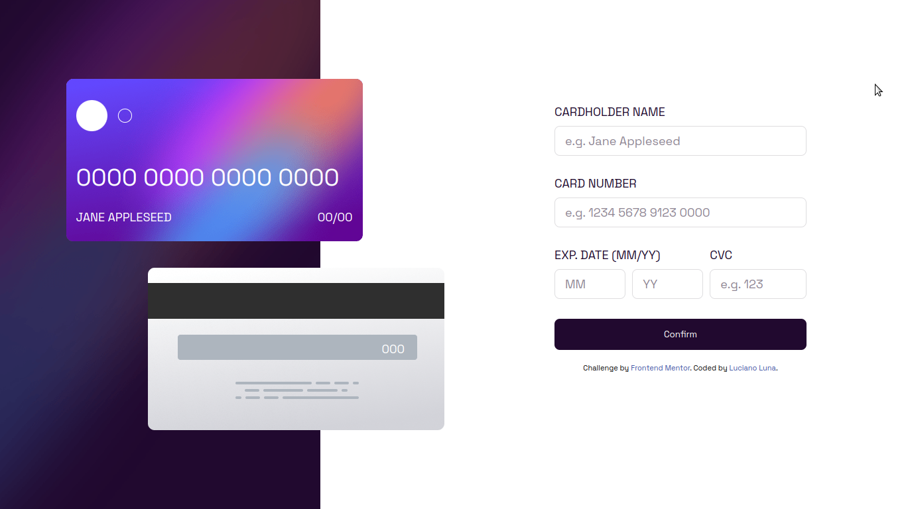

# Frontend Mentor - Interactive card details form solution

This is a solution to the [Interactive card details form challenge on Frontend Mentor](https://www.frontendmentor.io/challenges/interactive-card-details-form-XpS8cKZDWw). Frontend Mentor challenges help you improve your coding skills by building realistic projects. 

## Table of contents

- [Overview](#overview)
  - [The challenge](#the-challenge)
  - [Screenshot](#screenshot)
  - [Links](#links)
- [My process](#my-process)
  - [Built with](#built-with)
  - [What I learned](#what-i-learned)
  - [Useful resources](#useful-resources)
- [Author](#author)

## Overview

### The challenge

Users should be able to:

- Fill in the form and see the card details update in real-time
- Receive error messages when the form is submitted if:
  - Any input field is empty
  - The card number, expiry date, or CVC fields are in the wrong format
- View the optimal layout depending on their device's screen size
- See hover, active, and focus states for interactive elements on the page

### Screenshot

### Links

- Live Site URL: [challenge-frontendmentor](https://luciano275.github.io/challenge-frontendmentor/)

## My process

### Built with

- Semantic HTML5 markup
- CSS custom properties
- Flexbox
- Mobile-first workflow
- [React](https://reactjs.org/) - JS library

### What I learned

- Actually, while doing this challenge, as usual, I made mistakes. But thanks to those errors, and thanks to some pages, I was able to learn how to fix them, maybe not all of them, maybe the code has several errors, but they are things that can be improved by practicing. Thanks to this challenge, I was also able to learn more about CSS.

### Useful resources

- [Stack Overflow](https://es.stackoverflow.com/) - This helped me fix some issues with my logic in React.

- [CSS|MDN](https://developer.mozilla.org/es/docs/Web/CSS) - This helped me to create the responsive part of the page.

## Author

- Instagram - [Luna Luciano](https://www.instagram.com/gdgodnemesis/)
- Frontend Mentor - [@Luciano275](https://www.frontendmentor.io/profile/Luciano275)
